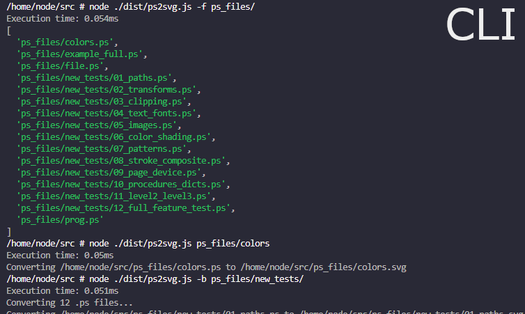

# PS2SVG

Convert PostScript to SVG

## Installation

```bash
npm i -g ps2svg
```

## Usage

`ps2svg` _[options]_ **<input.ps>** _[output.svg]_

### Info

- `<` `>` indicates a required argument. The `.ps` extension is optional.
- `[` `]` indicates an optional argument. The` .svg` extension is optional.

<br />

```bash
ps2svg my_ps
#      → Generates "my_ps.svg"
```

```bash
# (Accepts any variation of findAll, findall, FINDALL, FindAll, FiNdAlL)
ps2svg findAll
#      → Lists all .ps files found recursively
```

```bash
ps2svg path/to/my_ps.ps
#      → Generates "path/to/my_ps.svg"
```

```bash
ps2svg my_ps.ps new_svg.svg
#      → Generates "new_svg.svg"
```

<br />


